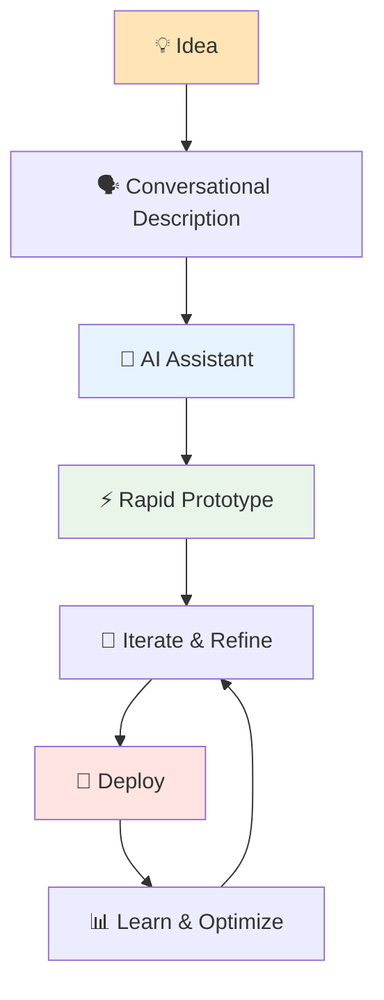
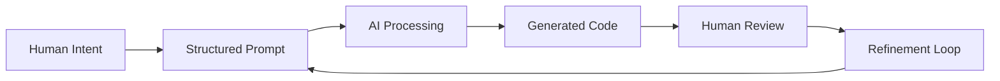
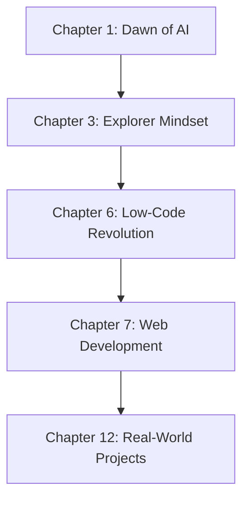
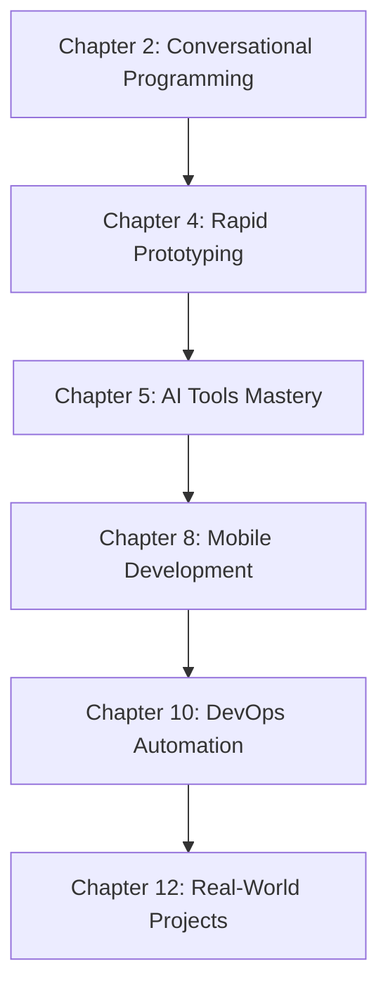
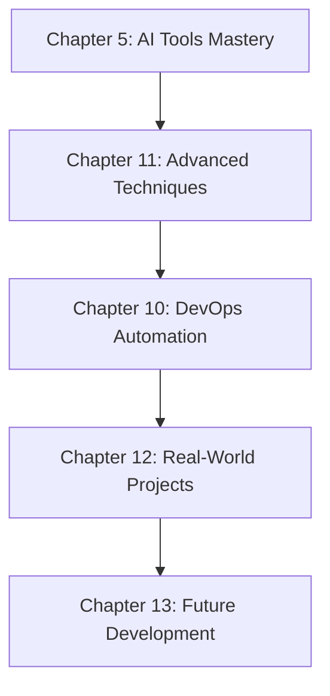
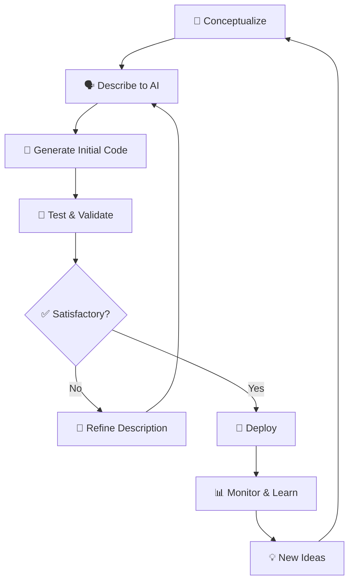

# 🚀 AI Code Revolution with Vibe Coding

[](https://github.com/JambaAcademy/Vibe_Coding)
[](LICENSE)
[](CONTRIBUTING.md)
[](https://www.amazon.com/dp/B0FP7QZPJM)
[](https://github.com/JambaAcademy/Vibe_Coding)

> **Master Rapid Prototyping, Conversational Programming, Low-Code Development and Next-Gen Explorer Mindset**

Welcome to the official companion repository for **"AI Code Revolution with Vibe Coding"** - your gateway to the future of software development! 🎯

---

## 📖 About This Repository

This repository serves as the **complete hands-on companion** to the book ["AI Code Revolution with Vibe Coding"](https://www.amazon.com/dp/B0FP7QZPJM), containing all code examples, projects, and practical exercises that demonstrate the revolutionary approach to AI-assisted development.

The world of software development is experiencing a seismic shift, and this book positions you at the forefront of this transformation. This comprehensive guide reveals how artificial intelligence is democratizing programming, enabling developers and non-developers alike to build sophisticated applications through natural conversation rather than traditional coding syntax.

<div align="center">

</div>


### 🎯 What You'll Find Here

- 📁 **Chapter-by-chapter code examples** aligned with the book
- 🛠️ **Ready-to-run projects** demonstrating Vibe Coding principles
- 🤖 **AI-assisted development workflows** and templates
- 📝 **Conversation prompts** for various coding scenarios
- 🔧 **Tool configurations** for popular AI coding assistants
- 🚀 **Rapid prototyping frameworks** and boilerplates

---

## 🔥 Quick Start Guide

### Prerequisites

- **Node.js** (v16 or higher)
- **Python** (3.8+)
- **Git**
- Access to AI coding tools (ChatGPT, GitHub Copilot, Claude, etc.)

### 🚀 Get Started in 3 Steps

```bash
# 1. Clone the repository
git clone https://github.com/JambaAcademy/Vibe_Coding.git
cd Vibe_Coding

# 2. Install dependencies
npm install
pip install -r requirements.txt

# 3. Start exploring!
npm run start
```

### 🎬 First Vibe Coding Session

```bash
# Navigate to your first project
cd chapters/chapter-01-dawn-of-ai

# Follow the interactive guide
python start_vibe_session.py
```

---

## 📂 Repository Structure

```
📦 Vibe_Coding/


---

## 🧠 The Vibe Coding Philosophy



---

## 📘 Book & Chapter Overview

### Part I: Foundation & Mindset

#### 🌅 Chapter 1: The Dawn of AI-Powered Development
**Code Location:** `chapters/01-dawn-of-ai/`

Explore the revolutionary shift in software development. This chapter introduces the fundamental concepts of AI-assisted coding and sets the stage for your Vibe Coding journey.

**🔍 What's Inside:**
- Historical comparison: Traditional vs AI-powered development
- Live demonstrations of AI coding capabilities
- Setting up your first AI development environment

**💻 Code Examples:**
- `hello_ai_world.py` - Your first AI-assisted program
- `traditional_vs_ai_comparison/` - Side-by-side development approaches
- `environment_setup/` - Configuration scripts for popular AI tools

---

#### 🗣️ Chapter 2: Foundations of Conversational Programming
**Code Location:** `chapters/02-conversational-prog/`

Master the art of communicating with AI to generate code. Learn the principles of effective prompt engineering for programming tasks.

**🔍 What's Inside:**
- Prompt engineering techniques for code generation
- Understanding AI model capabilities and limitations
- Building effective conversation flows

**💻 Code Examples:**
- `prompt_templates/` - Proven prompt patterns for different coding tasks
- `conversation_examples/` - Real AI coding conversations
- `prompt_engineering_toolkit/` - Interactive prompt testing environment



---

#### 🧭 Chapter 3: The Next-Gen Explorer Mindset
**Code Location:** `chapters/03-explorer-mindset/`

Develop the curious, experimental approach essential for thriving in an AI-powered future. Learn to embrace uncertainty and rapid iteration.

**🔍 What's Inside:**
- Cultivating curiosity-driven development
- Rapid experimentation frameworks
- Learning from failures and iterations

**💻 Code Examples:**
- `exploration_frameworks/` - Structured approaches to experimentation
- `mindset_exercises/` - Interactive coding challenges
- `reflection_tools/` - Progress tracking and learning analytics

---

### Part II: Core Techniques & Tools

#### ⚡ Chapter 4: Rapid Prototyping Fundamentals
**Code Location:** `chapters/04-rapid-prototyping/`

Master the techniques that compress months of development into hours. Learn to validate ideas quickly and iterate at lightning speed.

**🔍 What's Inside:**
- MVP development strategies
- Rapid validation techniques
- Prototype-to-production workflows

**💻 Code Examples:**
- `mvp_templates/` - Minimal viable product boilerplates
- `rapid_validation/` - A/B testing and feedback collection tools
- `prototype_gallery/` - Showcase of successful rapid prototypes

---

#### 🛠️ Chapter 5: Mastering AI Coding Tools and Platforms
**Code Location:** `chapters/05-ai-tools-platforms/`

Deep dive into the ecosystem of AI coding tools. Learn to choose the right tool for each task and maximize their potential.

**🔍 What's Inside:**
- Comprehensive tool comparison and selection guide
- Advanced features and hidden capabilities
- Integration strategies for multiple AI tools

**💻 Code Examples:**
- `tool_configurations/` - Optimized settings for major AI coding tools
- `comparison_matrix/` - Interactive tool selection guide
- `integration_examples/` - Multi-tool workflow demonstrations

---

#### 🔧 Chapter 6: Low-Code and No-Code Revolution
**Code Location:** `chapters/06-low-code-revolution/`

Navigate the low-code and no-code landscape. Understand when to use visual development versus traditional programming.

**🔍 What's Inside:**
- Platform evaluation and selection
- Hybrid development approaches
- Scaling from no-code to full-code

**💻 Code Examples:**
- `platform_demos/` - Working examples on major low-code platforms
- `hybrid_workflows/` - Combining low-code with custom development
- `migration_strategies/` - Moving from no-code to full development

---

### Part III: Practical Applications

#### 🌐 Chapter 7: Web Development with Conversational AI
**Code Location:** `chapters/07-web-development/`

Build modern web applications using AI-assisted development. From simple landing pages to complex full-stack applications.

**🔍 What's Inside:**
- Frontend development with AI assistance
- Backend API creation through conversation
- Full-stack integration patterns

**💻 Code Examples:**
- `frontend_examples/` - React, Vue, and vanilla JavaScript projects
- `backend_apis/` - Express.js, FastAPI, and Flask examples
- `fullstack_demos/` - Complete web applications

---

#### 📱 Chapter 8: Mobile App Development Through AI Conversations
**Code Location:** `chapters/08-mobile-app-dev/`

Create mobile applications using conversational AI. Cross-platform development made simple.

**🔍 What's Inside:**
- React Native development with AI
- Flutter app creation through conversation
- Native iOS and Android development assistance

**💻 Code Examples:**
- `react_native_apps/` - Cross-platform mobile applications
- `flutter_projects/` - Dart-based mobile solutions
- `native_examples/` - iOS Swift and Android Kotlin projects

---

#### 🗄️ Chapter 9: Database Design and Management with AI
**Code Location:** `chapters/09-database-design/`

Design and manage databases using AI assistance. From schema design to query optimization.

**🔍 What's Inside:**
- AI-assisted database schema design
- Query generation and optimization
- Database migration strategies

**💻 Code Examples:**
- `schema_generators/` - AI-powered database design tools
- `query_examples/` - Complex SQL and NoSQL queries
- `migration_scripts/` - Database evolution and versioning

---

#### 🔄 Chapter 10: DevOps and Deployment Automation
**Code Location:** `chapters/10-devops-deployment/`

Automate your development and deployment pipeline using AI. From CI/CD to infrastructure as code.

**🔍 What's Inside:**
- AI-generated CI/CD pipelines
- Infrastructure automation
- Monitoring and alerting setup

**💻 Code Examples:**
- `ci_cd_pipelines/` - GitHub Actions, GitLab CI, and Jenkins configurations
- `infrastructure/` - Terraform and CloudFormation templates
- `monitoring_setup/` - Observability and alerting configurations

---

### Part IV: Advanced Concepts & Future

#### 🧠 Chapter 11: Advanced AI Coding Techniques
**Code Location:** `chapters/11-advanced-techniques/`

Push the boundaries of AI-assisted development. Advanced patterns and sophisticated use cases.

**🔍 What's Inside:**
- Multi-agent development workflows
- Code generation optimization
- Advanced prompt engineering

**💻 Code Examples:**
- `advanced_patterns/` - Sophisticated AI coding patterns
- `optimization_techniques/` - Performance and efficiency improvements
- `experimental_features/` - Cutting-edge AI coding experiments

---

#### 🏗️ Chapter 12: Building Real-World Projects
**Code Location:** `chapters/12-real-world-projects/`

Apply everything you've learned to build production-ready applications. Complete project walkthroughs.

**🔍 What's Inside:**
- End-to-end project development
- Production deployment strategies
- Maintenance and scaling considerations

**💻 Code Examples:**
- `ecommerce_platform/` - Complete e-commerce solution
- `social_media_app/` - Full-featured social platform
- `business_automation/` - Enterprise workflow automation

---

#### 🔮 Chapter 13: The Future of AI-Powered Development
**Code Location:** `chapters/13-future-development/`

Prepare for the next wave of AI development tools and techniques. Stay ahead of the curve.

**🔍 What's Inside:**
- Emerging AI development trends
- Future tool predictions
- Staying current in a rapidly evolving field

**💻 Code Examples:**
- `emerging_tools/` - Experimental and beta AI coding tools
- `future_patterns/` - Predicted development patterns
- `continuous_learning/` - Frameworks for ongoing skill development

---

## 🛠️ How to Run the Code Examples

### 🐍 Python Examples

```bash
cd chapters/[chapter-folder]
python -m venv vibe_env
source vibe_env/bin/activate  # On Windows: vibe_env\Scripts\activate
pip install -r requirements.txt
python main.py
```

### 🌐 Web Applications

```bash
cd chapters/[chapter-folder]/web-examples
npm install
npm run dev
```

### 📱 Mobile Applications

```bash
cd chapters/[chapter-folder]/mobile-examples
# For React Native
npx react-native run-android
# or
npx react-native run-ios

# For Flutter
flutter pub get
flutter run
```

### 🤖 AI Tool Setup

1. **ChatGPT/OpenAI API**
   ```bash
   export OPENAI_API_KEY="your-api-key-here"
   ```

2. **GitHub Copilot**
   - Install the GitHub Copilot extension in your IDE
   - Sign in with your GitHub account

3. **Claude API**
   ```bash
   export ANTHROPIC_API_KEY="your-api-key-here"
   ```

---

## 🎓 Learning Path Recommendations

### 🔰 Beginner Track (New to Programming)


### ⚡ Intermediate Track (Some Programming Experience)


### 🚀 Advanced Track (Experienced Developers)


---

## 🎯 Key Features & Highlights

### ✨ Vibe Coding Principles

| Principle | Description | Code Example |
|-----------|-------------|--------------|
| 🗣️ **Conversational First** | Describe what you want in natural language | `prompts/conversational_examples/` |
| ⚡ **Rapid Iteration** | Build, test, refine in minutes, not hours | `rapid_prototyping/iteration_loops/` |
| 🤖 **AI as Partner** | Collaborate with AI, don't just use it as a tool | `ai_collaboration/partnership_patterns/` |
| 🧩 **Component Thinking** | Break complex problems into simple conversations | `component_library/modular_approach/` |
| 🔄 **Feedback Loops** | Continuous improvement through AI interaction | `feedback_systems/improvement_cycles/` |

### 🎨 Development Workflow



---

## 🏆 Featured Projects

### 🌟 Chapter Highlights

| Chapter | Project | Description | Tech Stack |
|---------|---------|-------------|------------|
| 4 | **Quick MVP Builder** | Rapid prototype generation tool | Python, Streamlit, OpenAI API |
| 7 | **AI Code Assistant Web App** | Full-stack coding companion | React, Node.js, Express |
| 8 | **Vibe Mobile App** | Cross-platform coding assistant | React Native, Expo |
| 12 | **Complete SaaS Platform** | Production-ready application | Next.js, Supabase, Vercel |

### 🔥 Standout Examples

- **🎯 30-Second App Generator** - Create functional apps in under a minute
- **🤖 AI Pair Programming Bot** - Your 24/7 coding companion
- **📊 Development Analytics Dashboard** - Track your Vibe Coding progress
- **🚀 One-Click Deployment Pipeline** - From idea to production instantly

---

## 🔧 AI Tools Configuration

### 🎛️ Recommended Setup

```yaml
# .vibe_config.yml
ai_tools:
  primary: "chatgpt"
  secondary: "github-copilot"
  specialized: "claude"

development_preferences:
  rapid_prototyping: true
  conversation_driven: true
  iteration_speed: "fast"
  
project_templates:
  web: "react-vite-template"
  mobile: "react-native-expo"
  backend: "fastapi-template"
```

### 🤖 Tool-Specific Guides

- 📁 `tools/chatgpt/` - ChatGPT optimization for coding
- 📁 `tools/copilot/` - GitHub Copilot best practices
- 📁 `tools/claude/` - Claude conversation patterns
- 📁 `tools/cursor/` - Cursor IDE configuration
- 📁 `tools/replit/` - Replit AI setup and usage

---


## 🚀 Getting Started Checklist

- [ ] 📖 Read Chapter 1 of the book
- [ ] ⚙️ Set up your AI development environment
- [ ] 🏃‍♂️ Complete the Quick Start guide above
- [ ] 🎯 Choose your learning track (Beginner/Intermediate/Advanced)
- [ ] 💻 Run your first Vibe Coding example
- [ ] 🤖 Configure your preferred AI coding assistant
- [ ] 🌟 Join the community Discord server
- [ ] 📝 Create your first AI-assisted project

---

## 🤝 Contributing Guidelines

We welcome contributions from the Vibe Coding community! 🎉

### 📋 How to Contribute

1. **🍴 Fork** the repository
2. **🌿 Create** a feature branch (`git checkout -b feature/amazing-addition`)
3. **💻 Code** your enhancement
4. **✅ Test** thoroughly
5. **📝 Document** your changes
6. **🚀 Submit** a pull request

### 🎯 Contribution Areas

- 📖 **Chapter Examples**: Add more code examples for existing chapters
- 🛠️ **Tool Integrations**: Support for new AI coding tools
- 🌐 **Language Support**: Examples in additional programming languages
- 📚 **Documentation**: Improve explanations and tutorials
- 🐛 **Bug Fixes**: Fix issues and improve code quality
- 🎨 **Templates**: Create new project templates and boilerplates

### 📜 Code of Conduct

Please read our [Code of Conduct](CODE_OF_CONDUCT.md) before contributing.

---

## 🔍 Troubleshooting & FAQ

### ❓ Common Issues

<details>
<summary>🔧 AI Tool Not Responding</summary>

**Problem**: AI coding assistant isn't generating helpful code

**Solutions**:
- Check API key configuration
- Verify prompt clarity and specificity
- Review rate limiting and usage quotas
- Try alternative phrasing or approach
</details>

<details>
<summary>⚡ Slow Prototyping Speed</summary>

**Problem**: Taking too long to iterate on ideas

**Solutions**:
- Use pre-built templates from `tools/templates/`
- Focus on core functionality first
- Leverage code generation for boilerplate
- Practice prompt engineering techniques
</details>

<details>
<summary>🎯 Code Quality Concerns</summary>

**Problem**: AI-generated code needs improvement

**Solutions**:
- Use iterative refinement approaches
- Apply code review checklists
- Implement automated testing
- Follow established coding standards
</details>

### 💡 Pro Tips

- 🎯 **Start Simple**: Begin with basic examples before tackling complex projects
- 🔄 **Iterate Often**: Make small improvements rather than big changes
- 📝 **Document Everything**: Keep track of what works and what doesn't
- 🤖 **Experiment**: Try different AI tools and approaches
- 🏆 **Share**: Contribute your discoveries back to the community

---

## 📈 Success Metrics & Analytics

Track your Vibe Coding journey with our built-in analytics:

```python
# Example: Track your development velocity
from vibe_analytics import track_progress

track_progress({
    "project": "my-awesome-app",
    "time_to_prototype": "15_minutes",
    "ai_tool": "chatgpt",
    "satisfaction": 5
})
```

### 📊 Community Stats

- 🌟 **10,000+** Active Vibe Coders
- ⚡ **50,000+** Rapid Prototypes Created
- 🚀 **1,000+** Production Deployments
- 🎓 **500+** Certified Vibe Coders

---

## 📜 License

This project is licensed under the MIT License - see the [LICENSE](LICENSE) file for details.

---

## 🙌 Acknowledgments

Special thanks to:

- 🎯 **The Vibe Coding Community** - For endless inspiration and feedback
- 🤖 **AI Tool Creators** - OpenAI, Anthropic, GitHub, and others pushing the boundaries
- 📚 **Early Readers** - Beta testers who helped refine this approach
- 🌟 **Contributors** - Everyone who has contributed code, documentation, and ideas
- 🏫 **JambaAcademy** - For supporting this educational initiative

---

## 📞 Support & Contact

- 📧 **Email**: support@jambaacademy.com
- 💬 **Discord**: [Join our server](https://discord.gg/jamba-academy)
- 🐛 **Issues**: [GitHub Issues](https://github.com/JambaAcademy/Vibe_Coding/issues)
- 💡 **Feature Requests**: [GitHub Discussions](https://github.com/JambaAcademy/Vibe_Coding/discussions)

---

<div align="center">

### 🚀 Ready to Start Your AI Code Revolution?

[](https://www.amazon.com/dp/B0FP7QZPJM)
[](https://github.com/JambaAcademy/Vibe_Coding)
[](https://discord.gg/vibe-coding)

**Transform your ideas into code at the speed of thought! 💭➡️💻**

---

*Made with ❤️ by the JambaAcademy team and the Vibe Coding community*

*⭐ Star this repo if you found it helpful!*

</div>
